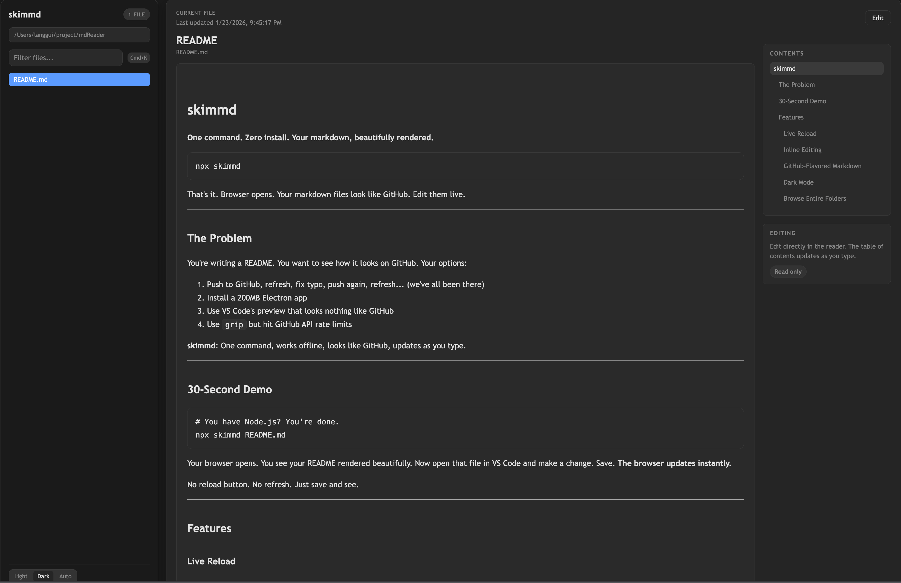
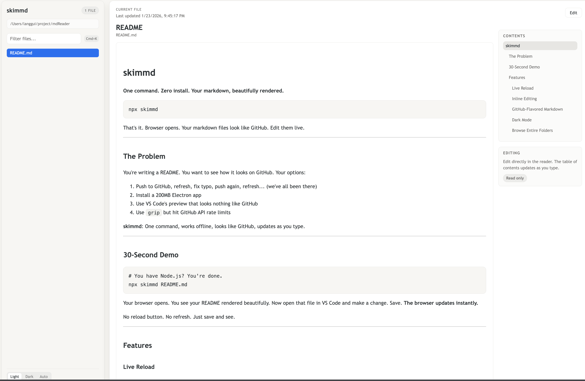

### skimmd

**One command. Zero install. Your markdown, beautifully rendered.**

```bash
npx skimmd
```

That's it. Browser opens. Your markdown files look like GitHub. Edit them live.

* * *

## The Problem

You're writing a README. You want to see how it looks on GitHub. Your options:

1.  Push to GitHub, refresh, fix typo, push again, refresh... (we've all been there)
2.  Install a 200MB Electron app
3.  Use VS Code's preview that looks nothing like GitHub
4.  Use `grip` but hit GitHub API rate limits

**skimmd**: One command, works offline, looks like GitHub, updates as you type.

* * *

## 30-Second Demo

```bash
# You have Node.js? You're done.
npx skimmd README.md
```

Your browser opens. You see your README rendered beautifully. Now open that file in VS Code and make a change. Save. **The browser updates instantly.**

No reload button. No refresh. Just save and see.

### Dark Mode



### Light Mode



* * *

## Features

### Live Reload

Edit in VS Code, Vim, or any editor. Save. Browser updates. No plugins, no extensions, no configuration.

### Inline Editing

Click "Edit" in the browser. Make changes. Hit Ctrl+S. **Saves directly to your .md file.** Your editor picks up the change. Round-trip editing.

### GitHub-Flavored Markdown

-   Tables render correctly
-   Task lists work (`- [x] like this`)
-   Syntax highlighting for 190+ languages
-   Fenced code blocks
-   Strikethrough, autolinks, all of it

### Dark Mode

Light, Dark, or Auto (follows your system). Because it's 2024 and we're not animals.

### Browse Entire Folders

```bash
npx skimmd ./docs
```

Sidebar shows all your markdown files. Filter them. Jump between them. Table of contents auto-generated from headings.

* * *

## Why Not Just Use...

Tool

The Problem

**VS Code Preview**

Doesn't look like GitHub. No live reload in browser.

**grip**

Hits GitHub API. Rate limited. Requires auth for private repos.

**Typora**

$15. Electron app. Doesn't look like GitHub.

**MacDown**

macOS only. No live reload. Dated UI.

**Obsidian**

Overkill for previewing a README. Different styling.

**glow**

Terminal only. Can't share screen with non-terminal people.

**peekmd**

Requires Bun. No editing. No live reload.

**skimmd**: Works with Node (you already have it). Zero config. Live reload. Inline editing. Looks like GitHub.

* * *

## Installation

**Option 1: No install (recommended)**

```bash
npx skimmd
```

**Option 2: Global install**

```bash
npm install -g skimmd
skimmd
```

* * *

## Usage

```bash
# Current directory
skimmd

# Specific file
skimmd README.md

# Documentation folder
skimmd ./docs

# Custom port
skimmd --port 8080

# Don't auto-open browser
skimmd --no-open
```

* * *

## Keyboard Shortcuts

Shortcut

Action

`Ctrl/Cmd + S`

Save (when editing)

`Ctrl/Cmd + K`

Focus file filter

* * *

## How It Works

1.  Starts a local Express server
2.  Watches your markdown files with chokidar
3.  Renders with `marked` (GitHub-flavored)
4.  Syntax highlighting with `highlight.js`
5.  Sends file changes via Server-Sent Events
6.  Browser updates without refresh

All local. Nothing leaves your machine. Works on a plane.

* * *

## FAQ

**Does it work offline?** Yes. Everything runs locally. No API calls.

**Can I use it for a presentation?** Yes. Dark mode + clean UI + live reload = great for live coding demos.

**Does it support Mermaid diagrams?** Not yet. PRs welcome.

**What about MDX?** Just markdown for now. Keep it simple.

**Windows support?** Yes. Works anywhere Node.js runs.

* * *

## Contributing

Found a bug? Want a feature? PRs welcome.

```bash
git clone https://github.com/lil-Zlang/skimmd
cd skimmd
npm install
npm link
skimmd ./docs
```

* * *

## License

MIT

* * *

**Stop pushing to GitHub just to preview your README.**  
`npx skimmd`